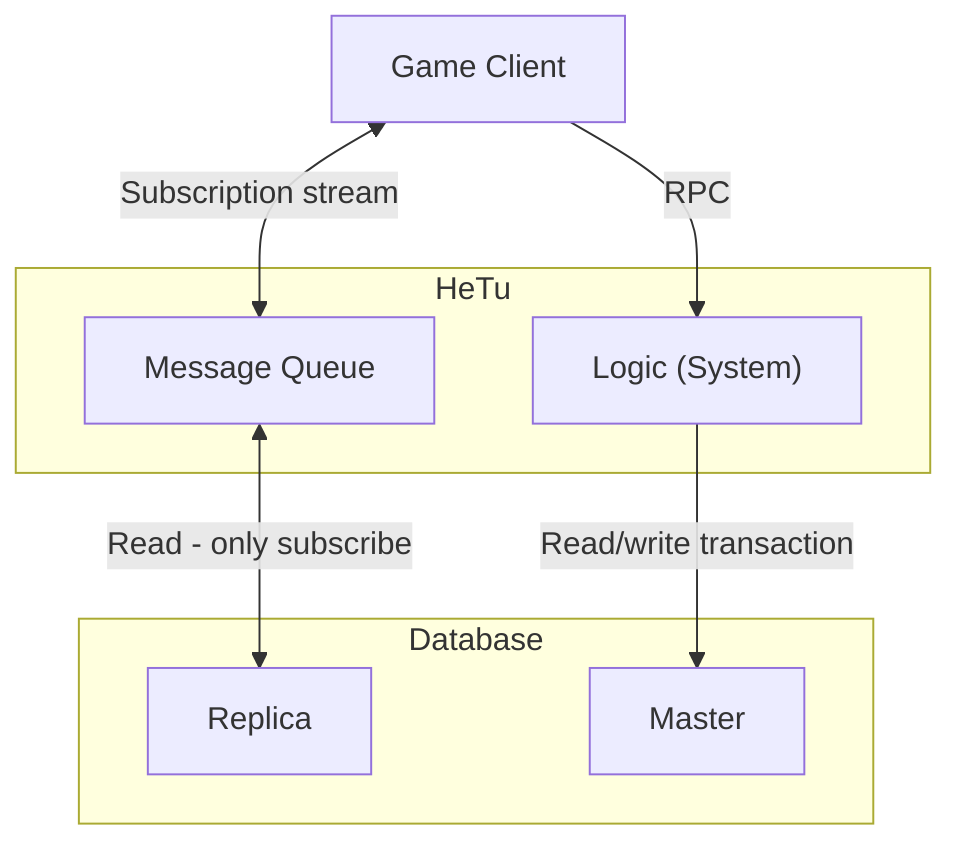

HeTu (河图) is a high-performance, multi-process, distributed game-server
engine. It uses the **Entity-Component-System (ECS)** pattern, stores state in
**Redis**, and exposes that state to game clients over **WebSocket** as a
subscribable, row-level-permissioned database.



## Why HeTu?

- **2-Tier development model.** Write game logic directly against typed
  components — no separate database layer, no ORM, no transaction plumbing.
- **Stateful long-lived connections.** Unlike Backend-as-a-Service products
  that focus on stateless CRUD, HeTu is built for in-memory game state with
  millisecond-scale push updates.
- **Redis throughput.** Roughly 10x the write throughput of typical
  BaaS-on-Postgres stacks; see the benchmarks in the project README.
- **Reactive Unity client.** The C# SDK ships with subscription objects that
  drive UI updates without polling.

## A 30-second example

Server (Python):

```python
import hetu
import numpy as np


@hetu.define_component(namespace="Chat", permission=hetu.Permission.EVERYBODY)
class ChatMessage(hetu.BaseComponent):
    owner: np.int64 = hetu.property_field(0, index=True)
    text: str = hetu.property_field("", dtype="U256")


@hetu.define_system(
    namespace="Chat", components=(ChatMessage,), permission=hetu.Permission.USER,
    retry=99
)
async def user_chat(ctx: hetu.SystemContext, text: str):
    row = ChatMessage.new_row()
    row.owner = ctx.caller
    row.text = text
    await ctx.repo[ChatMessage].insert(row)
```

Client (Unity / C#):

```csharp
await HeTuClient.Instance.CallSystem("user_chat", "Hello world");

var sub = await HeTuClient.Instance.Range<ChatMessage>("id", 0, long.MaxValue, 1024);
sub.AddTo(gameObject); 
sub.ObserveAdd().Subscribe(msg => Render(msg));
```

That's the entire wire: a typed table, an RPC entry point, and a reactive
subscription. No schema migrations, no API gateway, no message broker.

## Core concept: transactions

### Guarantees

* HeTu guarantees that a client's `System` calls execute in the order the
  client issued them; every call from a given client runs inside the same
  coroutine.
    - In other words, each player's own logic runs single-threaded, and the
      client's call order is never broken.
    - `async` / `await` does not break this guarantee — when an `await`
      suspends, control can only switch to coroutines belonging to *other*
      connections.
    - This also guarantees `System` calls are never dropped (unless the
      retry budget is exhausted or server crashed).

### Transaction conflicts and retries

* Writes inside a `System` may hit a transaction conflict; setting `retry > 0`
  reruns the `System` automatically.
    - Transactions use optimistic version locking and commit when the
      `System` function returns.
    - Any row that was read, or that is about to be written, raises a
      conflict if another process/coroutine changes it underneath.
        - Exception: `range()` queries don't lock the index, so other Systems adding,
          removing, or reordering rows in the queried range won't raise a conflict. Use
          `unique` constraint instead of index checks.
    - Any external or persistent side effect — updating `ctx` globals,
      writing to a file, sending a network call — must happen **after** the
      transaction commits. Otherwise the transaction may be discarded while
      those side effects have already taken hold. Use the explicit
      `ctx.session_commit()` to commit early; on conflict it raises, so any
      code below it will not execute.
    - Use `ctx.race_count` to tell which retry attempt the current run is.
* How to reduce transaction conflicts
    - The slower a `System` runs, the higher its conflict probability. If you
      need heavy computation inside a `System`, consider using `Endpoint` for more
      granular control.
    - Watch the slow log; only dig in if conflicts pile up.

## Where to next

- **[Getting Started](getting-started.md)** — install HeTu and run your first
  server in under 10 minutes.
- **[Tutorial: Chat Room](tutorial/chat-room.md)** — build the example above
  end-to-end.
- **[Concepts](concepts.md)** — the ECS model, subscriptions, permissions, and
  the transaction guarantees you get.
- **[Advanced](advanced.md)** — System copies, scheduled future calls,
  raw Endpoints, lifecycle hooks, and custom pipeline layers.
- **[Operations](operations.md)** — production deployment, Redis topology,
  and load balancing.
- **[API Reference](api/)** — auto-generated from source docstrings.

## Status

HeTu is currently in **closed beta**
