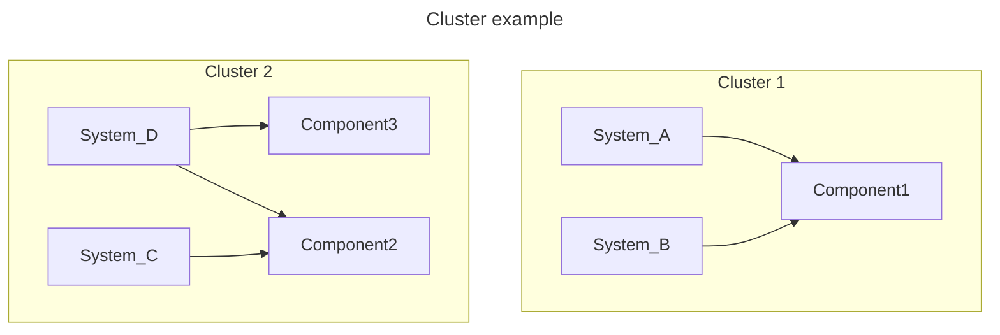

This page explains the mental model behind HeTu so you can reason about
performance, transactions, and security yourself instead of guessing.

## ECS in one paragraph

HeTu uses the Entity-Component-System pattern in its own form,
not the data-mapper sense the term has acquired in some web frameworks.
**`Entities`** are implicit — every row carries an int64 `id` and that is the
entity. **`Components`** are typed tables (one per logical kind of data).
**`Systems`** are async functions that operate on those tables inside a
transaction. There is no inheritance, no per-row methods, and no central
"world" object. State lives in Redis (or SQL); systems are stateless.

## Components

A `Component` is a typed table backed by NumPy structured arrays. You declare
it with `@define_component` and one `property_field()` per column:

```python
@hetu.define_component(namespace="Chat", permission=hetu.Permission.EVERYBODY)
class ChatMessage(hetu.BaseComponent):
    owner: np.int64 = hetu.property_field(0, index=True)
    text: str = hetu.property_field("", dtype="U256")
```

A few invariants that surprise new users:

- **Strings are fixed-width.** `dtype="U256"` is a 256-character UTF-32 column;
  longer values are truncated. This is the cost of NumPy C-struct like storage.
- **No nulls.** Every column has a default; you cannot tell whether a value
  was "set" or "still default". If you need optional data, split it into a
  separate Component and join via `owner`.
- **One index type, two flavors.** Indexes are always sorted sets supporting
  `range()` queries and subscriptions. `unique=True` is the same sorted index
  plus a uniqueness check on insert, and it implicitly turns on `index=True`.
- **`namespace=` is just a label.** Any string works. A running server binds
  to exactly one namespace at startup (`--namespace`) and only its `Systems`
  and `Endpoints` are loaded; `Components` from any namespace come along for the
  ride if those `Systems` reference them. To host multiple namespaces, start
  multiple servers.

## Systems

A `System` is an async function decorated with `@define_system`. It declares
which `Components` it touches via `components=(...)`, and runs inside a
transaction:

```python
@hetu.define_system(
    namespace="Chat", components=(ChatMessage,), permission=hetu.Permission.USER
)
async def user_chat(ctx: hetu.SystemContext, text: str):
    row = ChatMessage.new_row()
    row.owner = ctx.caller
    row.text = text
    await ctx.repo[ChatMessage].insert(row)
```

The `ctx` argument carries the transaction (`ctx.repo[Component]`), the
caller's id (`ctx.caller`), per-connection state (`ctx.user_data`), and a
handle for calling other `Systems` (`ctx.depend["other_system"]`).

### System Clusters — the unit of isolation

The `components=` declaration is not just a hint; the engine groups `Systems`
into **co-location clusters** based on overlap. Two `Systems` whose
`components=` sets share at least one `Component` live in the same cluster.
`Systems` in different clusters never conflict and run in parallel; `Systems`
in the same cluster contend for the same set of rows.



Practical consequence: declare `components=` accurately,
including extra `Components` may slow down systems.

### Calling another `System` with `depends`

A `System` can call other `Systems` and have them run **inside the same
transaction**. Declare the call up front in `depends=`, then invoke it
through `ctx.depend[...]`:

```python
@hetu.define_system(namespace="Shop", components=(Stock,))
async def add_stock(ctx, owner, qty):
    async with ctx.repo[Stock].upsert(owner=owner) as s:
        s.value += qty


@hetu.define_system(
    namespace="Shop", components=(Order,), depends=(add_stock,),
    permission=hetu.Permission.USER,
)
async def pay(ctx, order_id):
    async with ctx.repo[Order].upsert(id=order_id) as o:
        o.paid = True
        await ctx.depend["add_stock"](ctx, o.owner, o.qty)
    return hetu.ResponseToClient("ok")
```

What this buys you, and what it costs:

- **One Session, one commit.** The child `System` reads/writes through the
  same `ctx.repo[...]`, so either everything commits or `RaceCondition`
  retries the whole call from the parent's top.
- **Components inherit.** The parent transparently gains access to the
  child's declared Components — you don't need to repeat them in the
  parent's `components=`.
- **Return value passes through.** Whatever the child returns is what
  `await ctx.depend[...]()` returns. `ResponseToClient` only matters at the
  outermost `System` (the one the client RPC'd into).
- **Cluster merge.** All `Systems` linked by `depends` end up in the same
  co-location cluster as if their `components=` were unioned. This is the
  price of the shared transaction; plan your dependency graph accordingly.
- **Must be declared.** Calling a `System` that isn't in `depends=` raises at
  runtime — there is no implicit cross-`System` call.

This is the right tool for composing transactional logic. It is the wrong
tool for "I just want to reuse some code" — for that, write a plain async
helper that takes `ctx` and call it directly.

### `RaceCondition` and automatic retry

HeTu uses optimistic concurrency. Every Session keeps an `IdentityMap` of the
rows it read or wrote. On commit, the engine checks each row's version against
Redis. If anything changed underneath, the commit aborts with `RaceCondition`
and the engine **automatically re-runs the `System` from the top**, up to
`retry=` times (default 9999).

Two implications:

- Your `System` body must be **safe to re-run**. Don't send an HTTP request
  from inside a `System` unless that request is idempotent.
- Long-running `Systems` are more likely to lose the race. Keep them short;
  push slow work into a separate `Endpoint` that doesn't hold the transaction.

## Endpoints (advanced)

`Endpoints` are the underlying RPC primitive; `Systems` are `Endpoints` with a
transactional body. You only need to write a raw `Endpoint` when:

- You want to call **multiple** `Systems` from a single client RPC, with each
  `System` committing independently.
- You want to do work that doesn't touch `Components` at all (validation,
  fan-out to external services).

```python
@hetu.define_endpoint(namespace="Chat", permission=hetu.Permission.USER)
async def whoami(ctx: hetu.EndpointContext):
    return hetu.ResponseToClient({"id": ctx.caller})
```

**Caveat:** `Systems` called through an `Endpoint` do **not** share a transaction.
Each commits on its own. If you need atomicity across multiple `Components`,
declare a single `System` that lists all of them in `components=` instead.

## Subscriptions

Clients ask the server for live row data with two operations:

- **`select(Component, key=value)`** — one row, looked up by a unique key.
- **`range(Component, index, low, high, limit)`** — a sorted slice over an
  index, refreshed on every change.

Behind the scenes the `SubscriptionBroker` watches Redis pub/sub for row
changes, filters them by the client's permission level, and pushes deltas
back over the websocket. Latency is dominated by Redis round-trip — typically
under one millisecond on the same VPC.

Subscriptions are checked against the same permission system as `Systems`, so a
client cannot subscribe to data it isn't allowed to see.

## Permissions

Every `Component` and every `System` carries a `permission=` level. The four
useful levels:

| Level       | Meaning                                                                                                                                                                                                 |
|-------------|---------------------------------------------------------------------------------------------------------------------------------------------------------------------------------------------------------|
| `EVERYBODY` | Any websocket connection, including pre-`elevate`. Useful for chat history, lobby lists, anything public.                                                                                               |
| `USER`      | Connection must have called `elevate(ctx, user_id)` first (by server). Standard "logged in" gate.                                                                                                       |
| `OWNER`     | Same as USER plus an automatic row filter `row.owner == ctx.caller`. Use for personal inventory, private messages.                                                                                      |
| `RLS`       | Raw RLS filter. Declare `rls_compare=(operator, component_field, context_field)` on the `Component` to use a non-`owner` filter (for example, "rows whose `guild_id` matches the caller's `guild_id`"). |
| `ADMIN`     | Server-internal calls only; not exposed over the RPC wire.                                                                                                                                              |

OWNER and RLS are enforced inside `SessionRepository`, not just at the call
boundary. A `System` with `permission=USER` that reads an `permission=OWNER` `Component`
still only sees rows the caller owns — there is no way to "leak" through a more
privileged caller. That is: A `System`'s permissions merely determine who is authorized
to invoke that `System`; when reading data, access is still determined by the permission
definitions of the `Components`.

## Transactions

Every `System` call opens a `Session`. A Session holds an `IdentityMap` (the set
of rows touched), routes reads and writes through `SessionRepository` per
`Component`, and commits all writes atomically at the end. If two Sessions
conflict on a row, the second to commit raises `RaceCondition` and the engine
retries.

There is no need `BEGIN` / `COMMIT` — `Systems` are the transaction boundary.
If you need multiple steps that share a transaction, put them in one `System` or
use [`depends`](#calling-another-system-with-depends).
If you need early commit,
use [session_commit](advanced.md#early-session_commit--session_discard)

## Where to next

- **[Operations](operations.md)** — production deployment, Redis topology,
  load balancing.
- **[API Reference](api/)** — generated reference for every public symbol.
