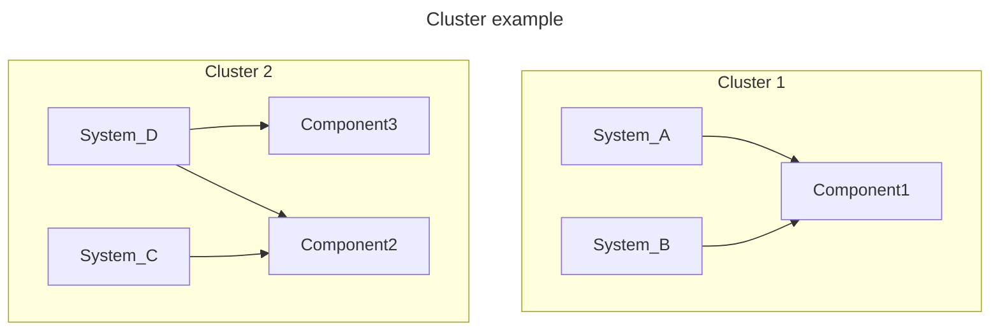

This page explains the mental model behind HeTu so you can reason about
performance, transactions, and security yourself instead of guessing.

## ECS in one paragraph

HeTu uses the Entity-Component-System pattern in its own form,
not the data-mapper sense the term has acquired in some web frameworks.
**`Entities`** are implicit — every row carries an int64 `id` and that is the
entity. **`Components`** are typed tables (one per logical kind of data).
**`Systems`** are async functions that operate on those tables inside a
transaction. There is no inheritance, no per-row methods, and no central
"world" object. State lives in Redis (or SQLite in development); systems are
stateless.

## Components

A `Component` is a typed table backed by NumPy structured arrays. You declare
it with `@define_component` and one `property_field()` per column:

```python
@hetu.define_component(namespace="Chat", permission=hetu.Permission.EVERYBODY)
class ChatMessage(hetu.BaseComponent):
    owner: np.int64 = hetu.property_field(0, index=True)
    text: str = hetu.property_field("", dtype="U256")
```

A few invariants that surprise new users:

- **Strings are fixed-width.** `dtype="U256"` is a 256-character UTF-32 column;
  longer values are truncated. This is the cost of NumPy C-struct like storage.
- **No nulls.** Every column has a default; you cannot tell whether a value
  was "set" or "still default". If you need optional data, split it into a
  separate Component and join via `owner`.
- **SQLite is for development only.** The SQLite backend emulates Redis's
  behavior on a local database file (index ordering, commit checks and
  subscription notifications all match Redis), so there is nothing to install
  and it is easy to debug, but it is not built for performance; use Redis in
  production.
- **One index type, two flavors.** Indexes are always sorted sets supporting
  `range()` queries and subscriptions. `unique=True` is the same sorted index
  plus a uniqueness check at commit, and it implicitly turns on `index=True`.
  `point_sub=True` declares that the index supports efficient point
  subscriptions (see [Subscriptions](#subscriptions)); it also implies
  `index=True`.
- **`namespace=` is just a label.** Any string works. A running server binds
  to exactly one namespace at startup (`--namespace`) and only its `Systems`
  and `Endpoints` are loaded; `Components` from any namespace come along for the
  ride if those `Systems` reference them. To host multiple namespaces, start
  multiple servers.

## Systems

A `System` is an async function decorated with `@define_system`. It declares
which `Components` it touches via `components=(...)`, and runs inside a
transaction:

```python
@hetu.define_system(
    namespace="Chat", components=(ChatMessage,), permission=hetu.Permission.USER
)
async def user_chat(ctx: hetu.SystemContext, text: str):
    row = ChatMessage.new_row()
    row.owner = ctx.caller
    row.text = text
    await ctx.repo[ChatMessage].insert(row)
```

The `ctx` argument carries the transaction (`ctx.repo[Component]`), the
caller's id (`ctx.caller`), per-connection state (`ctx.user_data`), and a
handle for calling other `Systems` (`ctx.depend["other_system"]`).

### System Clusters — the unit of isolation

The `components=` declaration is not just a hint; the engine groups `Systems`
into **co-location clusters** based on overlap. Two `Systems` whose
`components=` sets share at least one `Component` live in the same cluster.
`Systems` in different clusters never conflict and run in parallel; `Systems`
in the same cluster contend for the same set of rows.



Practical consequence: declare `components=` accurately,
including extra `Components` may slow down systems.

### Calling another `System` with `depends`

A `System` can call other `Systems` and have them run **inside the same
transaction**. Declare the call up front in `depends=`, then invoke it
through `ctx.depend[...]`:

```python
@hetu.define_system(namespace="Shop", components=(Stock,))
async def add_stock(ctx, owner, qty):
    async with ctx.repo[Stock].upsert(owner=owner) as s:
        s.value += qty


@hetu.define_system(
    namespace="Shop",
    components=(Order,),
    depends=(add_stock,),
    permission=hetu.Permission.USER,
)
async def pay(ctx, order_id):
    async with ctx.repo[Order].upsert(id=order_id) as o:
        o.paid = True
        await ctx.depend["add_stock"](ctx, o.owner, o.qty)
    return hetu.ResponseToClient("ok")
```

What this buys you, and what it costs:

- **One Session, one commit.** The child `System` reads/writes through the
  same `ctx.repo[...]`, so either everything commits or `RaceCondition`
  retries the whole call from the parent's top.
- **Components inherit.** The parent transparently gains access to the
  child's declared Components — you don't need to repeat them in the
  parent's `components=`.
- **Return value passes through.** Whatever the child returns is what
  `await ctx.depend[...]()` returns. `ResponseToClient` only matters at the
  outermost `System` (the one the client RPC'd into).
- **Cluster merge.** All `Systems` linked by `depends` end up in the same
  co-location cluster as if their `components=` were unioned. This is the
  price of the shared transaction; plan your dependency graph accordingly.
- **Must be declared.** Calling a `System` that isn't in `depends=` raises at
  runtime — there is no implicit cross-`System` call.

This is the right tool for composing transactional logic. It is the wrong
tool for "I just want to reuse some code" — for that, write a plain async
helper that takes `ctx` and call it directly.

### `RaceCondition` and automatic retry

HeTu uses optimistic concurrency. Every Session keeps an `IdentityMap` of the
rows it read or wrote. On commit, the engine checks each row's version against
Redis, as well as every range the Session read with `range` (a row added into
such a range counts as a change). If anything changed underneath, the commit
aborts with `RaceCondition`
and the engine **automatically re-runs the `System` from the top**, up to
`retry=` times (default 9999).

Two implications:

- Your `System` body must be **safe to re-run**. Don't send an HTTP request
  from inside a `System` unless that request is idempotent.
- Long-running `Systems` are more likely to lose the race. Keep them short;
  push slow work into a separate `Endpoint` that doesn't hold the transaction.

## Endpoints (advanced)

`Endpoints` are the underlying RPC primitive; `Systems` are `Endpoints` with a
transactional body. You only need to write a raw `Endpoint` when:

- You want to call **multiple** `Systems` from a single client RPC, with each
  `System` committing independently.
- You want to do work that doesn't touch `Components` at all (validation,
  fan-out to external services).

```python
@hetu.define_endpoint(namespace="Chat", permission=hetu.Permission.USER)
async def whoami(ctx: hetu.EndpointContext):
    return hetu.ResponseToClient({"id": ctx.caller})
```

**Caveat:** `Systems` called through an `Endpoint` do **not** share a transaction.
Each commits on its own. If you need atomicity across multiple `Components`,
declare a single `System` that lists all of them in `components=` instead.

## Subscriptions

Clients ask the server for live row data with three operations:

- **`select(Component, key=value)`** — one row, looked up by a unique key.
- **`range(Component, index, low, high, limit)`** — a sorted slice over an
  index, refreshed on every change.
- **`table(Component)`** — the whole table: every row you are allowed to see
  up front, then per-row deltas.

Behind the scenes the `SubscriptionBroker` watches Redis pub/sub for row
changes, filters them by the client's permission level, and pushes deltas
back over the websocket. Pushes are batched every `1/UPDATE_FREQUENCY`
(100 ms by default), so a change usually reaches the client within 100–200 ms.

Subscriptions are checked against the same permission system as `Systems`, so a
client cannot subscribe to data it isn't allowed to see.

**Subscriptions are best-effort and eventually consistent.** Under normal load
a client gets the latest data in about 99% of cases; when Redis is overloaded
(replica replication lag above ~100 ms), a client may keep stale data until
that row changes again. A notification only says "this row changed" and carries
no content, so the server re-reads the row from a random replica, which is not
necessarily the node that sent the notification. After every notification (and
after a subscription becomes active or pub/sub reconnects) the server reads
again at least one batching interval later; as long as replica lag stays within
that interval, what it reads is the latest value. Make decisions that need
strong consistency (spending currency, granting rewards, validation) inside a
`System` — write transactions are guarded by optimistic locking — rather than
relying on the subscription data a client holds.

**Identical queries are shared within a worker.** Subscriptions that are not
filtered by row-level security — components with `EVERYBODY` or `USER`
permission, or a caller that is an admin — are shared per query inside a worker:
connections that subscribe to the same query join one subscription, the server
reads and compares each change once, and a connection that subscribes later gets
the current result without touching the database. Public queries such as a
server-wide chat (thousands of players watching "the latest N messages"),
announcements or leaderboards therefore cost the same reads no matter how many
players watch them; what remains per connection is encoding and sending the
push. Subscriptions on `OWNER` / `RLS` components are filtered per connection
and are not shared, so their cost grows with the number of players.

What wakes a `range` up depends on the shape of the query. A **point query**
(`high` omitted, or `low == high` — `owner=me`, `zone=z`) on an index declared
with `point_sub=True` listens to the channel of that one index value and is only
notified when a row enters or leaves that value (insert, delete, or a row's
field changing to/from it). An **interval query**, and a point query on an index
without `point_sub`, listens to the whole index and is woken by any change to
any value of that index, re-running its comparison on the server (the server
logs a warning once when a point query lands here; `id` cannot declare
`point_sub`, so watch a single row by id with `select`). So for hot indexes such as
"every player watches their own inventory", declare `point_sub=True` and write
a point query — other players picking up items will not touch you:

```python
@hetu.define_component(namespace="Game", permission=hetu.Permission.OWNER)
class Item(hetu.BaseComponent):
    owner: np.int64 = hetu.property_field(0, point_sub=True)
    qty: np.int32 = hetu.property_field(1)
```

The cost of `point_sub`: every time a row *enters* a value (an insert, or the
field changing to that value) the commit sends one extra notification (a Redis
PUBLISH, which is replicated to every replica). Rows leaving a value need no
notification — the subscriber already watches that row. Declare it only on
indexes that are actually point-subscribed.

### When to use a table subscription

`select` and `range` subscribe to one Redis channel **per row** on the server;
a result set of a few thousand rows means a few thousand channels, which is
slow and eats into the per-connection quota. A table subscription takes a
different route: on commit, the engine publishes one extra table-level
notification per modified table carrying the list of changed `row_id`s, and a
table subscription listens to that single channel — it counts as one
subscription regardless of how many rows the table has.

Public (not RLS-filtered) `select` and `range` subscriptions are shared within
a worker, so those per-row channels are subscribed once per worker, not once
per connection; for a public table of a few hundred rows, a `range` over the
whole table is usually enough. Table subscriptions are mainly for larger
tables, and for RLS-filtered tables where every connection sees its own slice.

That notification costs a Redis PUBLISH (replicated to every replica) on every
commit, so it is only sent for components declared with `table_sub=True`;
table subscriptions on other components are rejected:

```python
@hetu.define_component(
    namespace="Game", permission=hetu.Permission.EVERYBODY, table_sub=True
)
class PlayerName(hetu.BaseComponent):
    owner: np.int64 = hetu.property_field(0, unique=True)
    name: str = hetu.property_field("", dtype="U16")
```

The trade-off is that the subscriber is notified about **every** write to
that table (the server filters by RLS before pushing), so it only fits tables
that are "many rows, small rows, rarely change" — all player names, the guild
list, public config. Keep using `range` for hot tables (positions, HP). The
server refuses tables larger than `MAX_TABLE_SUBSCRIPTION_ROWS` (100k by
default); the per-connection count is capped by `MAX_TABLE_SUBSCRIPTION`.

A table subscription reacts to RLS both ways (a `range` does so only for rows
inside its queried range): a row that loses permission is pushed as deleted, a
row that gains it is pushed as added.

## Permissions

Every `Component` and every `System` carries a `permission=` level; `OWNER` and
`RLS` are for `Components` only:

| Level       | Meaning                                                                                                                                                                                                 |
|-------------|---------------------------------------------------------------------------------------------------------------------------------------------------------------------------------------------------------|
| `EVERYBODY` | Any websocket connection, including pre-`elevate`. Useful for chat history, lobby lists, anything public.                                                                                               |
| `USER`      | Connection must have called `elevate(ctx, user_id)` first (by server). Standard "logged in" gate.                                                                                                       |
| `OWNER`     | Same as USER plus an automatic row filter `row.owner == ctx.caller` on subscriptions. Use for personal inventory, private messages.                                                                     |
| `RLS`       | Raw RLS filter. Declare `rls_compare=(operator, component_field, context_field)` on the `Component` to use a non-`owner` filter (for example, "rows whose `guild_id` matches the caller's `guild_id`"). |
| `ADMIN`     | Only admin connections (`ctx.group` starting with `"admin"`) may call the `System` or subscribe to the `Component`. For a server-internal `System`, use `permission=None`.                              |

`OWNER` and `RLS` only take effect on subscriptions (`select` / `range` / table
subscriptions): the server checks every row against the caller (admin
connections are not filtered) and never pushes rows the caller may not see.
Reads and writes through `ctx.repo` inside a `System` are **not** checked
against row-level permissions — a `System` with `permission=USER` can read and
modify anyone's rows of a `permission=OWNER` `Component`, and whatever it
returns through `ResponseToClient` is not filtered either. A `System`'s
permission only decides who may call it. This is by design: trades, guild
settlements and the like have to read and write other players' rows.

So before a `System` returns data to the client, or modifies someone else's rows
based on arguments from the client, it has to check that the caller is allowed
to. For example, a `System` that fetches a channel's message history should
first confirm that `ctx.caller` is a member of that channel, then read and
return the messages.

To hide a column from clients (server-internal state, secret roles and the
like), declare `hidden=True` on the field:

```python
@hetu.define_component(namespace="Game", permission=hetu.Permission.EVERYBODY)
class Player(hetu.BaseComponent):
    name: str = hetu.property_field("", dtype="U32")
    role: str = hetu.property_field("", dtype="U16", index=True, hidden=True)
```

Rows pushed by subscriptions (`select` / `range` / table subscriptions) never
carry `hidden` columns, for admin connections too, and a write that only
changes `hidden` columns is not pushed at all, since the client could not see
the difference. Clients cannot subscribe by a `hidden` column either: even
without its values, a query condition such as a `range` on `role` equal to
`"werewolf"` would reveal it, so a `hidden` field cannot declare `point_sub`.
Like row-level permissions, `hidden` only applies to subscriptions: `Systems`
read and write it as usual, and data returned through `ResponseToClient` is not
filtered; classes generated by `hetu build` leave the column out. Changing
`hidden` requires `hetu upgrade`, just like changing permissions (only the
schema version is updated, no data is moved).

## Transactions

Every `System` call opens a `Session`. A Session holds an `IdentityMap` (the set
of rows touched), routes reads and writes through `SessionRepository` per
`Component`, and commits all writes atomically at the end. If two Sessions
conflict on a row, the second to commit raises `RaceCondition` and the engine
retries.

There is no need `BEGIN` / `COMMIT` — `Systems` are the transaction boundary.
If you need multiple steps that share a transaction, put them in one `System` or
use [`depends`](#calling-another-system-with-depends).
If you need early commit,
use [session_commit](advanced.md#early-session_commit--session_discard)

## Where to next

- **[Operations](operations.md)** — production deployment, Redis topology,
  load balancing.
- **[API Reference](api/)** — generated reference for every public symbol.
