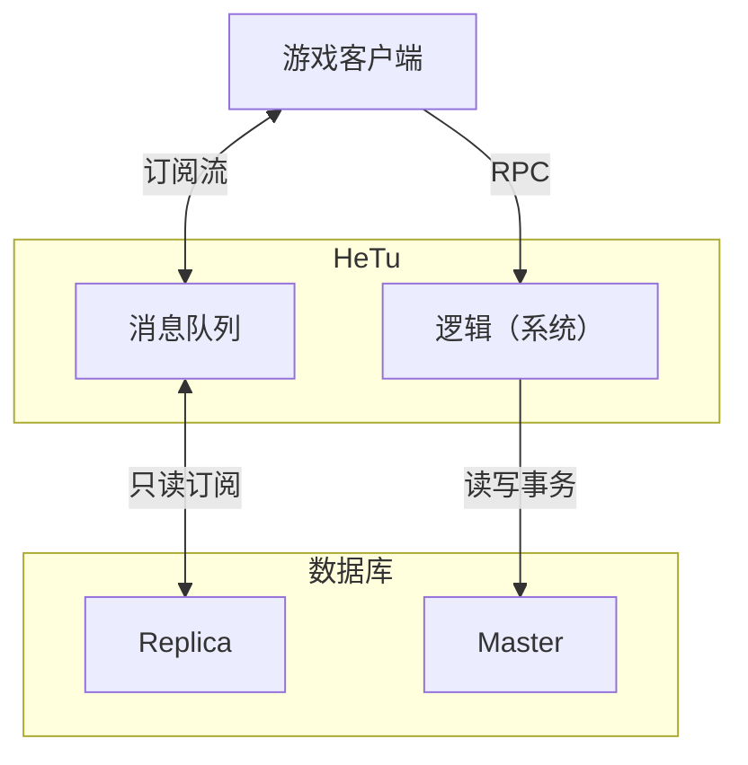

HeTu (河图) 是一个高性能、多进程、分布式的游戏服务器引擎。它采用 **实体-组件-系统 (ECS)** 模式，将状态存储在 **Redis** 中，并通过 **WebSocket** 以可订阅、行级权限的数据库形式向游戏客户端暴露这些状态。



## 为什么选择 HeTu？

- **两层开发模型。** 直接使用类型化的组件编写游戏逻辑——无需单独的数据库层、ORM 或事务处理。
- **有状态的长连接。** 与专注于无状态 CRUD 的后端即服务产品不同，HeTu 专为内存中的游戏状态而构建，支持毫秒级的推送更新。
- **Redis 吞吐量。** 写入吞吐量大约是典型基于 Postgres 的 BaaS 堆栈的 10 倍；请参阅项目 README 中的基准测试。
- **响应式 Unity 客户端。** C# SDK 提供订阅对象，无需轮询即可驱动 UI 更新。

## 一个 30 秒的示例

服务器端 (Python)：

```python
import hetu
import numpy as np


@hetu.define_component(namespace="Chat", permission=hetu.Permission.EVERYBODY)
class ChatMessage(hetu.BaseComponent):
    owner: np.int64 = hetu.property_field(0, index=True)
    text: str = hetu.property_field("", dtype="U256")


@hetu.define_system(
    namespace="Chat", components=(ChatMessage,), permission=hetu.Permission.USER,
    retry=99
)
async def user_chat(ctx: hetu.SystemContext, text: str):
    row = ChatMessage.new_row()
    row.owner = ctx.caller
    row.text = text
    await ctx.repo[ChatMessage].insert(row)
```

客户端 (Unity / C#)：

```csharp
await HeTuClient.Instance.CallSystem("user_chat", "Hello world");

var sub = await HeTuClient.Instance.Range<ChatMessage>("id", 0, long.MaxValue, 1024);
sub.AddTo(gameObject); 
sub.ObserveAdd().Subscribe(msg => Render(msg));
```

这就是完整的交互：一个类型化的表、一个 RPC 入口点和一个响应式订阅。无需模式迁移、API 网关或消息代理。

## 核心概念：事务

### 保证

* HeTu 保证客户端对 `System` 的调用按客户端发出的顺序执行；来自同一客户端的每次调用都在同一个协程内运行。
    - 换句话说，每个玩家自己的逻辑是单线程运行的，并且客户端的调用顺序永远不会被打乱。
    - `async` / `await` 不会破坏此保证——当 `await` 挂起时，控制权只能切换到属于*其他*连接的协程。
    - 这也保证了 `System` 调用永远不会被丢弃（除非重试预算耗尽或服务器崩溃）。

### 事务冲突与重试

* `System` 内部的写入可能会发生事务冲突；设置 `retry > 0` 会自动重新运行该 `System`。
    - 事务使用乐观版本锁定，并在 `System` 函数返回时提交。
    - 任何已被读取或即将被写入的行，如果被其他进程/协程在底层更改，则会引发冲突。
        - 例外：`range()` 查询不会锁定索引，因此其他 System 在查询范围内添加、删除或重新排序行时不会引发冲突。请使用 `unique` 约束代替索引检查。
    - 任何外部或持久化的副作用——更新 `ctx` 全局变量、写入文件、发送网络调用——必须在事务提交**之后**发生。否则，当事务被丢弃时，这些副作用可能已经生效。使用显式的 `ctx.session_commit()` 提前提交；如果发生冲突，它会引发异常，因此其下方的任何代码都不会执行。
    - 使用 `ctx.race_count` 来了解当前运行是第几次重试尝试。
* 如何减少事务冲突
    - `System` 运行越慢，其冲突概率越高。如果需要在 `System` 内部进行大量计算，请考虑使用 `Endpoint` 以获得更精细的控制。
    - 关注慢日志；只有在冲突堆积时才深入排查。

## 下一步

- **[入门指南](getting-started.md)** — 安装 HeTu 并在 10 分钟内运行你的第一个服务器。
- **[教程：聊天室](tutorial/chat-room.md)** — 端到端构建上述示例。
- **[概念](concepts.md)** — ECS 模型、订阅、权限以及你获得的事务保证。
- **[高级功能](advanced.md)** — System 副本、定时未来调用、原始 Endpoint、生命周期钩子和自定义管道层。
- **[运维](operations.md)** — 生产部署、Redis 拓扑和负载均衡。
- **[API 参考](api/)** — 从源码文档中自动生成。

## 状态

HeTu 目前处于**内测阶段**
