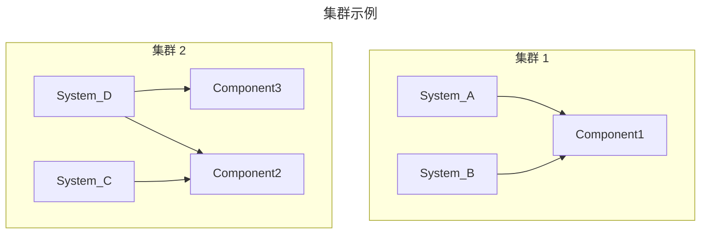

本页解释 HeTu 背后的思维模型，帮助您自行推理性能、事务和安全，而非猜测。

## ECS 简介

HeTu 以自身的形式使用实体-组件-系统模式，而非某些 Web 框架中已获得的数据映射器含义。
**`实体`** 是隐式的——每一行携带一个 int64 的 `id`，这就是实体。**`组件`** 是类型化的表（每种逻辑类型的数据一张表）。
**`系统`** 是在事务内操作这些表的异步函数。没有继承、没有按行方法、也没有中央“世界”对象。状态存储在 Redis（或 SQL）中；系统是无状态的。

## 组件

`组件` 是由 NumPy 结构化数组支持的类型化表。您使用 `@define_component` 声明它，并为每列添加一个 `property_field()`：

```python
@hetu.define_component(namespace="Chat", permission=hetu.Permission.EVERYBODY)
class ChatMessage(hetu.BaseComponent):
    owner: np.int64 = hetu.property_field(0, index=True)
    text: str = hetu.property_field("", dtype="U256")
```

几个让新用户惊讶的不变规则：

- **字符串是固定宽度的。** `dtype="U256"` 是一个 256 字符的 UTF-32 列；更长的值会被截断。这是使用类 NumPy C 结构存储的代价。
- **没有空值。** 每一列都有默认值；您无法判断某个值是“已设置”还是“仍为默认值”。如果您需要可选数据，请将其拆分为单独的组件，并通过 `owner` 进行连接。
- **一种索引类型，两种风格。** 索引始终是有序集合，支持 `range()` 查询和订阅。`unique=True` 是相同的排序索引，外加插入时的唯一性检查，同时隐式开启 `index=True`。
- **`namespace=` 只是一个标签。** 任何字符串都可以。运行中的服务器在启动时绑定到恰好一个命名空间（`--namespace`），并且只加载该命名空间的 `系统` 和 `端点`；如果这些 `系统` 引用了其他命名空间的 `组件`，则这些组件也会随之加载。要托管多个命名空间，请启动多台服务器。

## 系统

`系统` 是用 `@define_system` 装饰的异步函数。它通过 `components=(...)` 声明它接触的 `组件`，并在事务内运行：

```python
@hetu.define_system(
    namespace="Chat", components=(ChatMessage,), permission=hetu.Permission.USER
)
async def user_chat(ctx: hetu.SystemContext, text: str):
    row = ChatMessage.new_row()
    row.owner = ctx.caller
    row.text = text
    await ctx.repo[ChatMessage].insert(row)
```

`ctx` 参数携带事务（`ctx.repo[Component]`）、调用者 ID（`ctx.caller`）、每个连接的状态（`ctx.user_data`）以及用于调用其他 `系统` 的句柄（`ctx.depend["other_system"]`）。

### 系统集群——隔离单元

`components=` 声明不仅仅是一个提示；引擎根据重叠情况将 `系统` 分组为**放置在一起的集群**。两个 `系统` 的 `components=` 集合共享至少一个 `组件` 时，它们位于同一个集群中。不同集群中的 `系统` 从不冲突，并行运行；同一集群中的 `系统` 竞争同一组行。



实际影响：准确声明 `components=`；包含额外的 `组件` 可能会降低系统性能。

### 使用 `depends` 调用另一个 `系统`

一个 `系统` 可以调用其他 `系统`，并使它们在**同一事务内**运行。在 `depends=` 中预先声明调用，然后通过 `ctx.depend[...]` 调用它：

```python
@hetu.define_system(namespace="Shop", components=(Stock,))
async def add_stock(ctx, owner, qty):
    async with ctx.repo[Stock].upsert(owner=owner) as s:
        s.value += qty


@hetu.define_system(
    namespace="Shop", components=(Order,), depends=(add_stock,),
    permission=hetu.Permission.USER,
)
async def pay(ctx, order_id):
    async with ctx.repo[Order].upsert(id=order_id) as o:
        o.paid = True
        await ctx.depend["add_stock"](ctx, o.owner, o.qty)
    return hetu.ResponseToClient("ok")
```

它带来的好处和代价：

- **一个会话，一次提交。** 子 `系统` 通过同一个 `ctx.repo[...]` 进行读写，因此要么全部提交，要么 `RaceCondition` 从父系统的顶层重试整个调用。
- **组件继承。** 父系统透明地获得子系统声明的组件访问权限——您无需在父系统的 `components=` 中重复它们。
- **返回值传递。** 子系统返回的任何值就是 `await ctx.depend[...]()` 返回的值。`ResponseToClient` 仅在最外层的 `系统`（客户端通过 RPC 调用的那个）中才有意义。
- **集群合并。** 所有通过 `depends` 链接的 `系统` 最终会位于同一个放置集群中，就好像它们的 `components=` 进行过并集操作一样。这是共享事务的代价；请相应规划您的依赖图。
- **必须声明。** 调用不在 `depends=` 中的 `系统` 会在运行时引发错误——没有隐式的跨 `系统` 调用。

这是组合事务逻辑的正确工具。对于“我只想重用一些代码”的情况，这是错误的工具——为此，编写一个接受 `ctx` 的普通异步辅助函数并直接调用它。

### `RaceCondition` 和自动重试

HeTu 使用乐观并发。每个会话维护一个它所读取或写入的行的 `IdentityMap`。提交时，引擎会针对 Redis 检查每个行的版本。如果底层有任何变化，提交会因 `RaceCondition` 而中止，引擎会自动从顶层**重新运行 `系统`**，最多重试 `retry=` 次（默认 9999）。

两个含义：

- 您的 `系统` 主体必须是**安全可重入的**。除非该请求是幂等的，否则不要在 `系统` 内部发送 HTTP 请求。
- 运行时间较长的 `系统` 更容易失去竞争。保持它们简短；将慢速工作推送到一个不持有事务的单独 `端点` 中。

## 端点（高级）

`端点` 是底层的 RPC 原语；`系统` 是具有事务主体的 `端点`。仅当以下情况时才需要编写原始的 `端点`：

- 您希望从单个客户端 RPC 调用多个 `系统`，且每个 `系统` 独立提交。
- 您希望执行完全不涉及 `组件` 的工作（验证、扇出到外部服务）。

```python
@hetu.define_endpoint(namespace="Chat", permission=hetu.Permission.USER)
async def whoami(ctx: hetu.EndpointContext):
    return hetu.ResponseToClient({"id": ctx.caller})
```

**注意：** 通过 `端点` 调用的 `系统` **不共享**事务。每个系统独立提交。如果您需要跨多个 `组件` 的原子性，请声明一个将所有这些组件列在其 `components=` 中的单一 `系统`。

## 订阅

客户端通过两个操作向服务器请求实时行数据：

- **`select(Component, key=value)`** — 单行，通过唯一键查找。
- **`range(Component, index, low, high, limit)`** — 索引上的排序切片，每次更改都会刷新。

在后台，`SubscriptionBroker` 监视 Redis 的发布/订阅以获取行更改，根据客户端的权限级别过滤它们，并通过 WebSocket 推送增量。延迟主要由 Redis 往返时间决定——在同一 VPC 上通常低于一毫秒。

订阅受与 `系统` 相同的权限系统检查，因此客户端无法订阅其无权查看的数据。

## 权限

每个 `组件` 和每个 `系统` 都带有一个 `permission=` 级别。四个有用的级别：

| 级别        | 含义                                                                                                                                                                                                   |
|-------------|-------------------------------------------------------------------------------------------------------------------------------------------------------------------------------------------------------|
| `EVERYBODY` | 任何 WebSocket 连接，包括在 `elevate` 之前。适用于聊天历史、大厅列表等任何公开内容。                                                                                                                     |
| `USER`      | 连接必须先调用 `elevate(ctx, user_id)`（由服务器调用）。标准的“已登录”门槛。                                                                                                                             |
| `OWNER`     | 与 `USER` 相同，外加自动行过滤 `row.owner == ctx.caller`。用于个人库存、私信等。                                                                                                                        |
| `RLS`       | 原始 RLS 过滤。在 `组件` 上声明 `rls_compare=(operator, component_field, context_field)` 以使用非 `owner` 过滤器（例如，“其 `guild_id` 与调用者的 `guild_id` 匹配的行”）。                          |
| `ADMIN`     | 仅限服务器内部调用；不通过 RPC 传输层暴露。                                                                                                                                                             |

`OWNER` 和 `RLS` 是在 `SessionRepository` 内部强制执行的，而不仅仅在调用边界强制执行。一个具有 `permission=USER` 的 `系统` 读取一个具有 `permission=OWNER` 的 `组件` 时，仍然只能看到调用者拥有的行——无法通过更高权限的调用者“泄露”。也就是说：`系统` 的权限仅决定谁被授权调用该 `系统`；读取数据时，访问权限仍然由 `组件` 的权限定义决定。

## 事务

每次 `系统` 调用都会打开一个 `会话`。一个会话持有一个 `IdentityMap`（接触到的行集），通过每个 `组件` 的 `SessionRepository` 路由读写，并在最后原子性地提交所有写入。如果两个会话在某一行上冲突，则第二个提交的会话会引发 `RaceCondition`，引擎会重试。

不需要 `BEGIN` / `COMMIT`——`系统` 就是事务边界。如果您需要共享事务的多个步骤，请将它们放在一个 `系统` 中，或使用 [`depends`](#使用-depends-调用另一个系统)。如果您需要提前提交，请使用 [session_commit](advanced.md#早期-session_commit--session_discard)。

## 下一步

- **[运维](operations.md)** — 生产部署、Redis 拓扑、负载均衡。
- **[API 参考](api/)** — 每个公共符号的生成参考。
